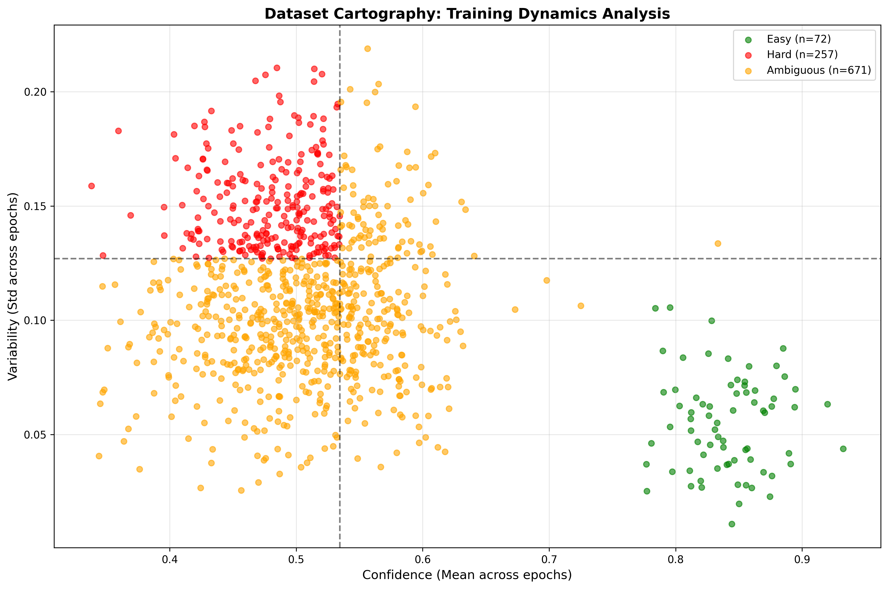

# Dataset Cartography Analysis Report

## Overview

Dataset cartography analysis of SQuAD training dynamics to identify and mitigate dataset artifacts.

**Analysis Date**: C:\Users\agsil\OneDrive\UTA-MSAI\Natural Language Processing\Assignments\nlp-final-project  
**Total Examples Analyzed**: 1000

## Training Dynamics Summary

### Category Distribution

| Category | Count | Percentage | Description |
|----------|-------|------------|-------------|
| **Easy** | 72 | 7.2% | High confidence, low variability, high correctness |
| **Hard** | 257 | 25.7% | Low confidence, high variability, low correctness |
| **Ambiguous** | 671 | 67.1% | Mixed dynamics, possible mislabeling |

### Thresholds Used

- **Confidence Threshold**: 0.534
- **Variability Threshold**: 0.127  
- **Correctness Threshold**: 0.500

## Artifact Pattern Detection

### Position Bias Artifacts
- **Front Position Bias Examples**: 42
- These examples have answers in the first 20% of the passage and high correctness
- Indicates potential exploitation of position shortcuts

### Question Type Bias Artifacts  
- **Temporal Question Bias**: 8
- "When" questions with high correctness rates
- Suggests stereotypical question-answer associations

## Metrics Distribution

### Confidence
- **Mean**: 0.527
- **Standard Deviation**: 0.104

### Variability  
- **Mean**: 0.110
- **Standard Deviation**: 0.038

### Correctness
- **Mean**: 0.073
- **Standard Deviation**: 0.260

## Data Map Visualization

The data map shows the relationship between confidence and variability:
- **Bottom-right quadrant**: Easy examples (high confidence, low variability)
- **Top-left quadrant**: Hard examples (low confidence, high variability)
- **Top-right quadrant**: Ambiguous examples (variable patterns)

## Mitigation Recommendations

### 1. Upweight Hard Examples Strategy
- **Rationale**: Hard examples likely contain genuine linguistic complexity
- **Implementation**: 2x weight for hard examples, 0.5x for easy examples
- **Expected Impact**: Reduced artifact exploitation, improved generalization

### 2. Remove Easy Examples Strategy  
- **Rationale**: Easy examples may exploit spurious correlations
- **Implementation**: Filter out easy examples from training
- **Expected Impact**: Forces model to learn from complex cases

### 3. Balanced Category Strategy
- **Rationale**: Ensure equal representation across difficulty levels
- **Implementation**: Reweight to balance category sizes
- **Expected Impact**: More robust training distribution

## Generated Files

1. `cartography_analysis.json` - Complete analysis results
2. `training_weights_upweight_hard.json` - Weights for hard example upweighting
3. `training_weights_remove_easy.json` - Weights for easy example removal
4. `training_weights_balanced.json` - Weights for balanced training
5. `cartography_data_map.png` - Visualization of training dynamics

## Next Steps

1. **Train Mitigated Model**: Use generated weights with modified training loop
2. **Compare Performance**: Evaluate artifact reduction vs. QA performance
3. **Iterate Strategy**: Adjust weighting based on results

---

*This analysis uses the dataset cartography methodology from Swayamdipta et al. (2020) to identify training dynamics patterns and mitigate dataset artifacts.*
